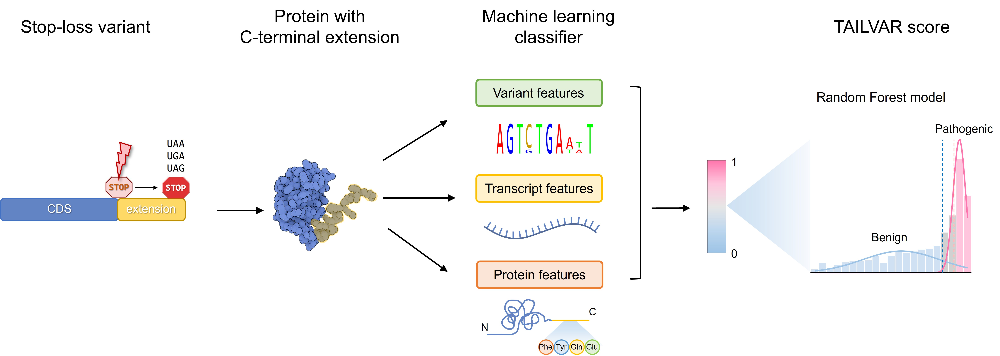

# TAILVAR (Terminal codon Analysis and Improved prediction for Lengthened VARiants)
😊 Welcome to the **TAILVAR** repository, home to the codebase for developing the TAILVAR score. 🚀 **TAILVAR** is a predictive tool designed to assess the functional impact of stop-lost variants that occur at stop 🛑 codons (TAA, TGA, TAG).

# Overview
**TAILVAR** is built using a Random Forest model that predicts the pathogenicity of **stop-lost variants**. The model leverages a combination of in-silico scores, transcript features, and protein context information. The TAILVAR score ranges from 0 to 1, representing the probability of a variant being pathogenic.

## Key components

- **Functional prediction scores**:
  - **CADD** (Combined Annotation Dependent Depletion): http://cadd.gs.washington.edu/
  - **DANN** (Deleterious Annotation of genetic variants using Neural Networks): https://cbcl.ics.uci.edu/public_data/DANN/
  - **FATHMM** (Functional Analysis through Hidden Markov Models): http://fathmm.biocompute.org.uk/fathmmMKL.htm
  - **Eigen**: http://www.columbia.edu/~ii2135/eigen.html
  - **BayesDel_addAF**, **BayesDel_noAF** (Bayesian Deleteriousness score with/without allele frequency): http://fengbj-laboratory.org/BayesDel/BayesDel.html
  - **integrated_fitCons** (Integrated Fitness Consequence Score): DOI: 10.1038/ng.3196

- **Conservation scores**:
  - **GERP** (Genomic Evolutionary Rate Profiling): http://mendel.stanford.edu/SidowLab/downloads/gerp/
  - **phyloP100way** (Phylogenetic P-value across 100 vertebrates): http://hgdownload.soe.ucsc.edu/goldenPath/hg38/phyloP100way/
  - **phastCons100way** (Phylogenetic Conserved Elements across 100 vertebrates): http://hgdownload.soe.ucsc.edu/goldenPath/hg38/phastCons100way/

- **Transcript features**:
  - **Gene_GC**: GC content of the gene
  - **UTR3_GC**: GC content of the 3' UTR
  - **UTR3_length**: Length of the 3' UTR

- **Protein contexts**:
  - **TailAA_counts**: Total counts of amino acids in the extended tail
  - **20 amino acids counts**: Counts of each of the 20 amino acids in the extended tail

