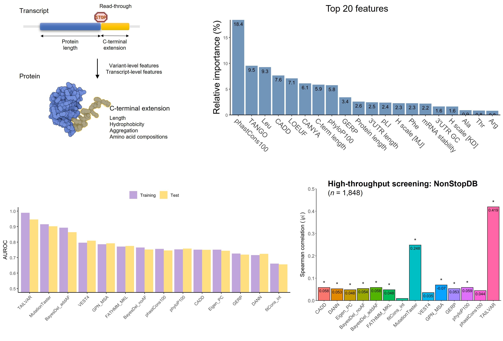

# TAILVAR (Terminal codon Analysis and Improved prediction of Lengthened VARiants)
😊 Welcome to the **TAILVAR** repository! This repository stores the codes for developing the TAILVAR score designed to assess the functional impact of **stop-loss variants** occurring at stop codons (TAA, TGA, TAG) 🚀


# Overview
**TAILVAR** is built using a Random Forest model that predicts the pathogenicity of **stop-loss variants**. By integrating a combination of in-silico prediction scores, transcript features, and protein context information, **TAILVAR** provides a score ranging from 0 to 1, indicating the probability of a variant being pathogenic. The threshold of >0.92 can be used to identify pathogenic or leikely pathogenic variants.


## Key components

- **Functional prediction scores**:
  - **[CADD](http://cadd.gs.washington.edu/)** (Combined Annotation Dependent Depletion)
  - **[DANN](https://cbcl.ics.uci.edu/public_data/DANN/)** (Deleterious Annotation of genetic variants using Neural Networks)
  - **[FATHMM](http://fathmm.biocompute.org.uk/fathmmMKL.htm)** (Functional Analysis through Hidden Markov Models)
  - **[Eigen](http://www.columbia.edu/~ii2135/eigen.html)**
  - **[BayesDel_addAF, BayesDel_noAF](https://fenglab.chpc.utah.edu/BayesDel/BayesDel.html)** (Bayesian Deleteriousness score with/without allele frequency)
  - **[integrated_fitCons](https://www.nature.com/articles/ng.3196)** (Integrated Fitness Consequence Score)

- **Conservation scores**:
  - **[GERP](http://mendel.stanford.edu/SidowLab/downloads/gerp/)** (Genomic Evolutionary Rate Profiling)
  - **[phyloP100way](http://hgdownload.soe.ucsc.edu/goldenPath/hg38/phyloP100way/)** (Phylogenetic P-value across 100 vertebrates)
  - **[phastCons100way](http://hgdownload.soe.ucsc.edu/goldenPath/hg38/phastCons100way/)** (Phylogenetic Conserved Elements across 100 vertebrates)

- **Transcript features**:
  - **Gene_GC**: GC content of the gene
  - **UTR3_GC**: GC content of the 3' UTR
  - **UTR3_length**: Length of the 3' UTR

- **Protein contexts**:
  - **TailAA_counts**: Total counts of amino acids in the extended tail
  - **Amino acids counts**: Counts of each of the 20 amino acids in the extended tail
  - **Hydrophobicity**: Proportions of hydrophobic amino acids (A,C,I,L,M,F,W,V) in the extended tail

# Annotation
To annotate **TAILVAR** scores in VEP, use the following command:
```bash
./vep [...] --custom file=TAILVAR_score.vcf.gz,short_name=TAILVAR,format=vcf,type=exact,fields=score
```

# Download
Datasets including **TAILVAR** scores for all possible single nucleotide substitutions are available for download [here](https://zenodo.org/records/13846886).

# Citation
If you use **TAILVAR** in your research, please cite:

JG Yoon. *Integrating transcriptomic and protein features to improve the pathogenicity prediction of stop-loss variants.*
